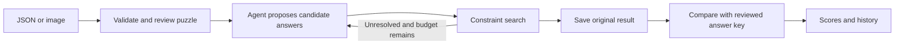

# Crosscheck — crossword-solving agent

Solve English word and arithmetic crosswords from **JSON, screenshots, or photos**, then evaluate the original result against a reviewed answer key.

The agent uses **Nebius GLM-5.3** to propose word answers. Python enforces lengths, fixed cells and crossing letters, and the agent revisits unresolved clues within explicit limits. **GLM-5.3-Flash** reads images. A complete grid can still be wrong: correctness is measured separately against an answer key.

## Quick start

You need **Python 3.11 or newer**, [uv](https://docs.astral.sh/uv/getting-started/installation/), Git, and a Nebius API key with access to the configured models. No Node build or separate database server is required.

```shell
git clone https://github.com/OWNER/crosscheck-crossword-agent.git
cd crosscheck-crossword-agent
uv sync --frozen
```

Create your local configuration without overwriting an existing key:

**Windows PowerShell**

```powershell
if (-not (Test-Path .env)) { Copy-Item .env.example .env }
notepad .env
```

**macOS / Linux**

```bash
[ -f .env ] || cp .env.example .env
# Open .env in your text editor.
```

Set `NEBIUS_API_KEY=your_key_here`, save the file, then start the app:

```shell
uv run --frozen crossword serve
```

Open **http://127.0.0.1:8000**. Keep the terminal running; press **Ctrl+C** to stop. Never commit `.env`. Without a key, you can still inspect samples, saved results, and evaluation methodology.

For a pip-only installation, model configuration, another port, or troubleshooting, see **[Setup](docs/SETUP.md)**.

## Use the agent

1. Open **Workspace** and choose a sample, upload JSON, or supply a puzzle image containing the grid **and all clues**.
2. For images, review and correct the extracted puzzle before accepting it.
3. Choose solver limits and click **Solve**. Inspect the filled grid, candidates, activity and model usage.
4. Open **Evaluation**. Select a saved attempt and provide the correct answers by editing a copy, importing JSON, or importing a solved image.
5. Review every answer and approve the key. The app scores the **unchanged original attempt**, records the evaluation, and updates the history chart.

Changed key cells use italic letters and peach highlighting. Image transcriptions remain drafts until reviewed. **[Full usage guide](docs/USER_GUIDE.md)**

## What the scores mean

| Metric | Meaning |
|---|---|
| Cell accuracy | Correct letters/digits divided by all open cells |
| Answer accuracy | Entirely correct answers divided by all entries |
| Completion | Filled cells divided by all open cells, including wrong letters |
| Exact puzzle | Every cell correct, with no rule violations |
| Constraint violations | Broken rules, such as inconsistent crossings or changed givens |

Accuracy needs a trusted key; it does not need an answer image specifically. Grading uses deterministic comparison, not an LLM judge. Time, calls and tokens are recorded separately. **[Evaluation guide](docs/INTERACTIVE_EVALUATION.md)**

## How it works



Arithmetic clues use a restricted exact-arithmetic parser. Words use model candidates plus deterministic search. The solver never receives the evaluation answer key.

## Code and documentation

```text
src/crossword_agent/
  models.py, domain.py      Input contracts and crossword rules
  agent.py, search.py       Bounded controller and constraint search
  arithmetic.py, vision.py  Arithmetic and grid-image processing
  providers/               Model provider interface and Nebius adapter
  evaluation*.py           Reference scoring and SQLite history
  web/                     Application setup, route groups, uploads and middleware
  api.py, cli.py            Compatible ASGI and command-line entry points
  static/js/, static/css/  Browser controllers, shared state and styles
data/                      Authored puzzles and separate solution keys
tests/                     Offline tests you can run locally
docs/                      Setup, usage, architecture and evaluation
artifacts/                 Clearly labelled historical development evidence
```

- [Setup and troubleshooting](docs/SETUP.md)
- [User guide and input/output examples](docs/USER_GUIDE.md)
- [Architecture and design decisions](docs/ARCHITECTURE.md)
- [Developer guide](docs/DEVELOPMENT.md) and [API contracts](docs/IMPLEMENTATION_CONTRACT.md)
- [Evaluation methodology](docs/EVALUATION.md) and [historical results](docs/RESULTS.md)
- [Earlier 48-second walkthrough](artifacts/demo/crosscheck-walkthrough.mp4): synthetic narration over captured screens; predates the latest evaluation UI and refactor.

## Scope and verification

This is an organized **local assessment application**, with typed contracts, bounded jobs, input validation and persistent result history. It runs as one loopback-bound server process. Public multi-user hosting would require authentication, per-user isolation, durable job execution and deployment controls. Active jobs cannot resume after a restart.

The latest organization refactor received static code review, syntax/lint checks and a package build. **Automated tests and live model evaluations were not rerun for this refactor**, as requested by the project owner. GitHub checks are manual-only; see the developer guide.

Historical Flash-model scores and the small authored puzzle suite do not establish general GLM-5.3 accuracy. See [artifact provenance](artifacts/README.md) and [the supplied-image case studies](artifacts/user-puzzles/RESULTS.md).
