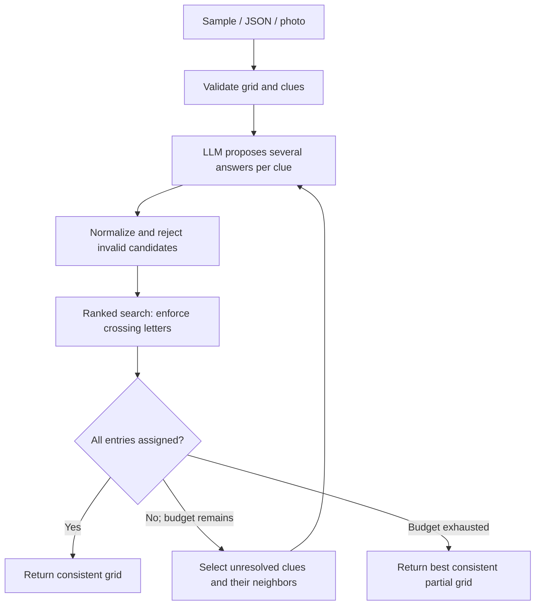

# Crosscheck — a crossword-solving agent

A small, inspectable agent that proposes answers with **Nebius GLM-5.3-Flash**, checks them with a deterministic constraint solver, and revisits clues when the current candidates cannot complete the grid. Supports sample puzzles, JSON upload, and screenshot/photo transcription with an editable review step.

**Complete and consistent does not mean independently correct.** The app checks grid rules. The evaluation runner separately compares results with answer keys that the solver never receives.

## Run locally

Requires Python 3.11+ and a Nebius API key. Tested setup is recorded in `uv.lock` and `requirements.lock`.

```powershell
# From the repository root, using uv:
uv sync --frozen --extra dev
Copy-Item .env.example .env
# Edit .env and set NEBIUS_API_KEY. Keep the provided endpoint/model defaults.
uv run crossword serve
```

Open **http://127.0.0.1:8000**. An existing configured `.env` should be preserved, not overwritten. The API key stays on the server and is ignored by Git.

For a quick overview, watch the [48-second narrated app walkthrough](artifacts/demo/crosscheck-walkthrough.mp4). It is assembled from actual browser screenshots with labeled synthetic narration, not a continuous live recording.

Without uv:

```powershell
python -m venv .venv
.venv\Scripts\python -m pip install -r requirements.lock
.venv\Scripts\python -m pip install --no-deps -e .
.venv\Scripts\python -m crossword_agent.cli serve
```

On macOS/Linux use `.venv/bin/python` and `cp .env.example .env`. No Node build, database, or external frontend assets are needed. The server binds to loopback only.

## Use it

1. Choose a sample or upload a puzzle JSON.
2. For an image, include **both the grid and the across/down clues**. PNG, JPEG and WebP are supported, up to 10 MB / 16 million pixels. Images are sent to the configured Nebius model and are not retained by this application.
3. Review/edit the extracted JSON and validate it before accepting the puzzle. Tiny clue numbers must not become cell letters.
4. Select **Solve**. The activity log shows actual model requests, accepted candidates, searches and repairs.
5. Inspect the grid and candidate list, or download the result JSON. Cancellation is cooperative; an in-flight model call may need to return or time out first.

Run from the command line:

```powershell
uv run crossword solve data/puzzles/dev-mixed-3.json --output artifacts/my-result.json
uv run crossword evaluate --split test
uv run pytest -q
uv run ruff check .
```

Evaluation uses real model calls and therefore consumes API quota. Offline tests use controlled providers and require no key or network.

## Input and output

```json
{
  "id": "mini",
  "title": "A tiny example",
  "grid": ["...", "...", "..."],
  "clues": {
    "across": {"1": "Feline", "4": "Large primate", "5": "Bread grain"},
    "down": {"1": "Road vehicle", "2": "Savings yield, briefly", "3": "Golf ball support"}
  }
}
```

`.` means empty; `#` means a block; A–Z are supplied letters that cannot change. Code derives row-major numbering, positions, lengths and crossings. Every entry of at least two cells requires exactly one clue. Rectangular grids between 2 and 25 cells per side are supported. Cryptic-specific logic, rebus cells, non-English alphabets, and arbitrary puzzle numbering are outside the current supported scope.

The output includes `grid`, `assignments` keyed by `1A`/`1D`, unresolved entries, structural violations, actual model-call/token counts, elapsed time, candidate lists, stop reason and event trace. Status is `complete_consistent`, `partial`, `cancelled`, or `provider_error`. Invalid input is rejected before model calls. Scores are ranking hints, not measured confidence probabilities. Dollar cost stays unknown unless both verified token prices are configured.

## How the agent works



The controller holds candidate pools, tentative assignments, attempts and resource budgets. It chooses entries to revisit from the current failure state. This is a **bounded agent with an explicit policy**, not an unconstrained LLM planner. The model interprets clues; code owns geometry and rules.

Search uses minimum-remaining-values ordering, AC-3 constraint propagation and ranked backtracking. If a full assignment is impossible with the available candidates, a bounded search preserves the best consistent partial assignment found. It prioritizes number of filled entries, then summed candidate scores; it does not claim globally optimal scoring of all complete solutions.

Retries include tentative crossing patterns and previous candidates. Guessed letters can be undone; user-supplied letters cannot. The controller stops at configurable round, call, time and search-node budgets. Provider SDK retries are disabled so every attempted request is visible in the call budget. Unknown billed usage for failed transport requests cannot be reconstructed and is documented as a limitation.

## Project structure

```text
src/crossword_agent/
  models.py             Validated input/output contracts
  domain.py             Grid geometry, numbering, hard constraints
  search.py             Deterministic search and partial fallback
  agent.py              State, candidate merging, targeted repair, budgets
  providers/            Provider interface and Nebius text/image adapter
  config.py             Environment settings and secret handling
  jobs.py               Bounded background jobs and cancellation
  api.py                HTTP validation, uploads, sample and job endpoints
  cli.py                Serve / solve / evaluate commands
  evaluation.py         Independent reference scoring and paired baselines
  static/               Browser UI, local CSS/JS and visual explanation
data/puzzles/           Inputs only
data/solutions/         Answer keys, read only by evaluation/tests
data/manifest.json      Provenance, split and dataset limitations
tests/                  Offline unit and integration tests
artifacts/evaluation/   Measured reports from live evaluation
docs/                   Architecture, evaluation and <=60-second demo script
```

## Evaluation and submission

Read [the simple explanation](docs/EXPLAINED_SIMPLY.md), [measured results](docs/RESULTS.md), [the methodology](docs/EVALUATION.md), [architecture explanation](docs/ARCHITECTURE.md), and [demo script](docs/DEMO_SCRIPT.md). The app's Evaluation tab displays the saved measured report when available.

The three comparison arms share the same initial model-generated candidates: independent top choices, constraint search, and the full repair agent. Additional repair calls are reported separately through usage totals. The authored smoke suite is small and not representative of published newspaper puzzles; full methodology and per-puzzle failures belong alongside any aggregate result.

For a stronger follow-up evaluation, freeze the prompts and code, add a licensed independent collection of ordinary published crosswords, stratify by size/difficulty, repeat model runs, and measure image transcription separately. Do not equate model confidence or completion with accuracy.

The repository is prepared locally for review. Upload to GitHub and publishing are separate steps; no remote was created automatically.

## Operational boundaries

This is a maintainable local assessment application with typed contracts, separated components, bounded jobs, input validation, sanitized provider failures and deterministic regression tests. Jobs live in memory and expire; restarting the process loses them. It is designed for one local server process, not a multi-worker public deployment. Public hosting would require authentication, a durable job store, per-user quotas and deployment-specific controls.

Image quality affects extraction; always inspect the preview. A full consistent grid can still be semantically wrong. If the correct answer never enters the candidate pool, search alone cannot recover it. Those limitations are part of the design and the evaluation.

## References

- [Automated Crossword Solving, ACL 2022](https://aclanthology.org/2022.acl-long.219/): research precedent for separating candidate generation and grid inference. This project implements its own simpler search; it does not reproduce Berkeley's system or published results.
- [Nebius Token Factory documentation](https://docs.tokenfactory.nebius.com/): provider API documentation. The configured endpoint/model are verified with actual requests during development.
