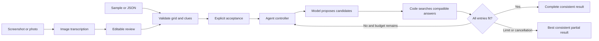
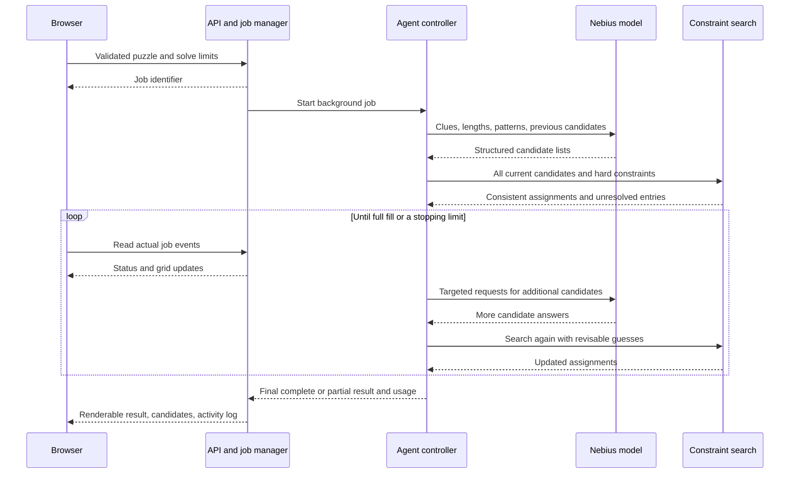

# How Crosscheck works

Crosscheck combines two different strengths: a language model interprets crossword clues, and Python code checks the exact rules of the grid. One controller coordinates the repeated attempts and decides when to stop.

## The input and output

The solver receives a rectangular grid and numbered across/down clues. A dot (`.`) represents an empty cell, `#` represents a blocked cell, and an A–Z letter represents a supplied letter that the solver must preserve. The parser derives answer positions, lengths, standard numbering, and crossings from this input. It rejects missing or extra clues and unsupported grid structures.

Users can choose a sample, upload JSON, or upload a PNG/JPEG/WebP screenshot. Image extraction is a separate model operation: its proposed transcription appears in an editable JSON preview alongside the image. The user validates the structure, checks the transcription, and explicitly accepts it before solving. Structural validation cannot establish whether a photographed clue was transcribed accurately.

The output contains a rendered grid, proposed answers, unresolved entries, constraint violations, candidate lists, a stop reason, and actual runtime/model usage. The browser can download that result as JSON. `complete_consistent` means the answers fill every entry while obeying the structural constraints. It does **not** mean an answer key has confirmed every answer.

## Why the agent keeps several answers

Consider a four-letter clue, “Financial institution.” BANK and FUND may both be plausible. The model proposes alternatives instead of committing the whole grid to its first guess. If one answer makes crossing clues impossible, search can undo it and try another.

Each entry is a variable, and its candidate answers are its possible values. Intersections create exact equality constraints between shared letters. Search uses these constraints to remove incompatible possibilities, then tries the most constrained entries first. Candidate scores rank choices; they are not calibrated correctness probabilities.

Search first attempts a full fill and retains a consistent partial fill when a complete one is impossible within the current candidates or limits. Partial results are ranked by assigned entry count and then model scores. A completed search returns a ranked valid fill; it does not promise the globally highest-scoring solution.

Search cannot choose an answer that was never proposed. When the candidate lists are insufficient, the controller revisits unresolved entries and related crossing clues, supplies useful tentative patterns, and requests more candidates. Supplied letters remain fixed; letters inferred from the agent's guesses remain revisable.

## Code responsibilities

| Module | Responsibility |
|---|---|
| `models.py` | Typed public inputs, options, events, candidates, and results |
| `domain.py` | Grid parsing, numbering, crossings, normalization, and hard rule checks |
| `search.py` | Bounded constraint propagation and backtracking |
| `providers/base.py` | Provider interface and sanitized provider errors |
| `providers/nebius.py` | OpenAI-compatible Nebius requests and response validation |
| `agent.py` | Candidate generation, repair decisions, budgets, events, and result assembly |
| `jobs.py` | Background solve lifecycle, cancellation, and job snapshots |
| `api.py` | HTTP validation, samples, extraction, solving, and evaluation access |
| `evaluation.py` | Scoring against separate reference answers and paired comparisons |
| `static/` | Accessible browser workspace, import preview, live events, and explanations |

The browser contains no provider credential and makes no direct model-provider requests. Keys are loaded by server configuration. Uploaded puzzle content and model output are data, not application instructions; the browser renders them as text rather than executable HTML.

## Bounded execution and failure behavior

Each solve has limits for elapsed time, rounds, model attempts, search nodes, and candidates. Jobs can be cancelled. Network/model failures are surfaced as sanitized errors, and available partial progress is returned where possible. An in-flight network call may take time to end; cancellation is therefore cooperative rather than a claim of immediate provider interruption.

The browser polls job events and renders actual elapsed time, model calls, final token usage, search work, and placements. It does not fabricate activity or display model confidence as answer accuracy. A disconnected browser reports the connection problem without claiming the server job has stopped.

This is a local, single-server assessment application. In-memory job state is intentionally simple and does not survive a process restart. A shared production deployment would require persistent job storage, authentication, per-user quotas, and deployment-specific monitoring. The module boundaries make those additions possible without changing crossword search.

## How to evaluate the design

Reference keys are separate from puzzle inputs and never sent to the solving agent. Evaluation compares three methods on the same puzzles: the first candidate for each clue, constraint search over the initial candidate lists, and the full agent with repair. Where possible the first two baselines share the full run's initial candidates so the comparison isolates search and repair rather than a different random model response.

Letter accuracy, answer accuracy, and exact-puzzle accuracy measure correctness against reference keys. Completion and constraint violations measure structural behavior. Candidate recall identifies missing-answer problems, and runtime/token usage shows the cost of each approach. Empty cells stay in the accuracy denominator.

The authored smoke suite demonstrates the pipeline on small controlled fixtures. Repeated word-square answers and sparse blocked grids make some fixtures easier than ordinary newspaper crosswords. Even perfect scores on that suite cannot establish general crossword ability or demonstrate an improvement over the baseline when all methods already succeed. See [EVALUATION.md](EVALUATION.md) for the scoring protocol and limitations.

## A simple interview explanation

> “I separate language understanding from exact rule checking. The model proposes several answers for each clue. Code checks lengths, given letters, and shared crossing letters. The agent revisits clues when those answers cannot fit together, and stops within a fixed budget. I evaluate correctness against separate answer keys and compare the full agent with simpler baselines.”
