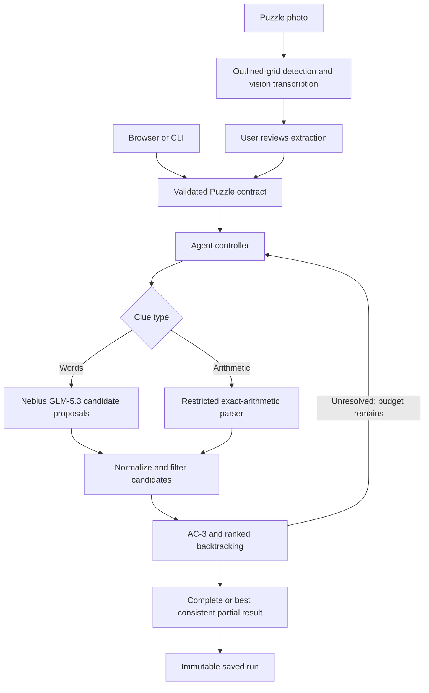
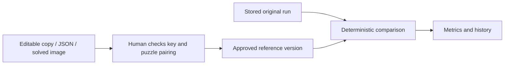

# Architecture

Crosscheck is a bounded solving agent with deterministic crossword rules. The model interprets clues; Python controls geometry, candidate filtering, search, budgets and grading.

## Solve flow



The agent keeps candidate pools and tentative assignments. Search prioritizes entries with few candidates, propagates crossing constraints, and backtracks when choices conflict. When it cannot finish, the controller selects unresolved clues and neighbors for another bounded proposal round. A sparse-word review can seek alternatives for weakly crossed entries. Supplied letters remain fixed; guessed letters can change.

Stops are bounded by time, rounds, model calls, candidate counts and search nodes. Candidate scores rank suggestions; they are not calibrated probabilities. A consistent complete result is not a semantic correctness guarantee.

## Components

```text
crossword_agent/
  models.py                Validated domain input/output contracts
  domain.py                Geometry, entries, givens and hard constraints
  search.py                Constraint propagation and bounded backtracking
  agent.py                 State, candidate merging, repair and budgets
  arithmetic.py            Restricted rational-arithmetic evaluation
  vision.py                Regular outlined-grid geometry and image cropping
  providers/
    base.py                Provider contracts and safe errors
    nebius.py              Text/vision transport and structured model responses
  evaluation.py            Reference scoring and paired benchmark arms
  evaluation_store.py      SQLite snapshots, key versions and grades
  jobs.py                  Bounded background jobs and cooperative cancellation
  config.py                Environment settings and server-side secrets
  cli.py                   Serve, solve and evaluate commands
  api.py                   Compatible ASGI entry point
  web/
    application.py         Per-app composition and lifecycle
    services.py            Shared jobs, providers, paths and history
    schemas.py             HTTP-only request schemas
    middleware.py          Body limits, local-origin/host checks and headers
    uploads.py             Decode, bound and normalize supported images
    routes/
      system.py            Health, safe configuration and app entry
      catalog.py           Samples and saved development cases
      solving.py           Validation and job endpoints
      history.py           Immutable runs and approved-key grading
      images.py            Puzzle and reference-image transcription
  static/
    app.js                 Initialize controllers and switch views
    js/state.js            Separate workspace and grading state
    js/shared.js           Safe DOM, HTTP and formatting helpers
    js/workspace.js        Puzzle selection and solve lifecycle
    js/puzzle-view.js      Grid/clue/candidate rendering
    js/puzzle-import.js    Puzzle import and extraction review
    js/evaluation.js       Reference editing, approvals, metrics and history
    css/base.css           Shared design and workspace styles
    css/evaluation.css     Evaluation styles and overrides
```

The frontend remains framework-free and build-free. Modules form an acyclic dependency graph. CSS loads base rules before evaluation overrides, preserving the visual layout.

## Evaluation flow



Editing a key cannot rewrite the original result. Each approval records source provenance and a key version. An image is transcribed with the vision model and remains an unapproved draft. Image-extraction usage is accounted for separately from the original solve. There is no answer-key path into candidate generation and no LLM judge for exact grading.

## Storage and lifecycle

Completed runs and approved references persist in local SQLite under `artifacts/private/`. Jobs execute in memory and cannot resume after process exit. An abrupt crash can prevent a final snapshot from being recorded. Imported historical cases retain their original model identity and start ungraded in interactive history.

The application supports one loopback-bound server process. Upload size/pixel limits, origin checks and bounded jobs protect this local boundary; they are not a substitute for authentication or multi-user isolation. Public service deployment would require authenticated users, separate user data, durable workers/queueing, quotas, monitoring and an operational deployment plan.

## Tradeoffs and limits

- A small explicit policy is easier to inspect than an unconstrained planner; candidate coverage still limits solving quality.
- Local SQLite avoids a separate service; it does not provide distributed job execution.
- JSON provides precise input; photos are convenient but require transcription review.
- The grid detector assumes regular, roughly upright outlined cells. Skewed or decorative images can fail.
- Deterministic reference grading is reproducible; its correctness still depends on the key.
- Historical smoke puzzles demonstrate behavior, not general published-crossword performance.

See [API contracts](IMPLEMENTATION_CONTRACT.md), [development](DEVELOPMENT.md), and [evaluation](EVALUATION.md) for implementation details.
