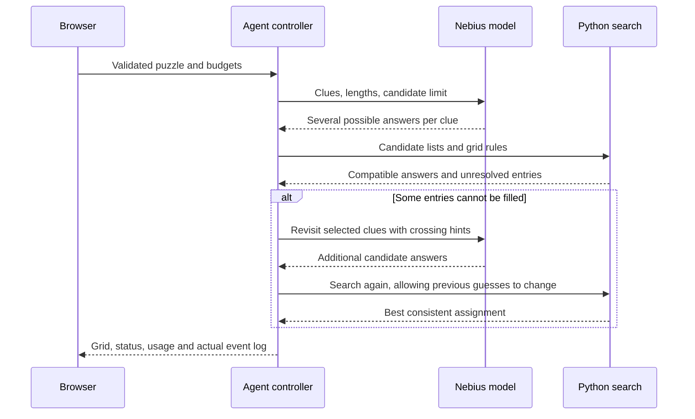
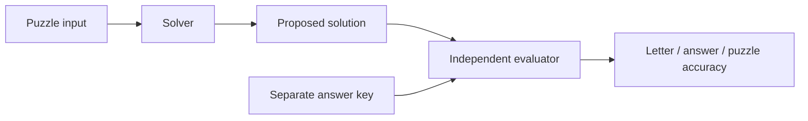
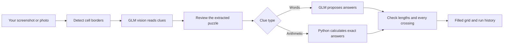

# Explain the project in plain English

## The 30-second explanation

“The user gives us a crossword grid and its clues, either as JSON or as a picture. For a picture, we first extract the grid and clues and let the user correct mistakes. The model suggests possible answers. Python checks which combinations fit the crossing letters. If the available answers do not complete the puzzle, the agent revisits the blocked clues and tries alternatives. We evaluate the final output against separate answer keys.”

## What happens when someone presses Solve?

For example, “Pet” with three cells might suggest **DOG** or **CAT**. A crossing clue “Road vehicle” might suggest **CAR**. If those words share their first letter, DOG and CAR cannot both fit. The search can choose CAT and CAR. It checks letters exactly; it does not ask the model whether D equals C.

The answers used in that example are illustrative. The real logs record the actual candidates and choices from each run.

## Which part is AI, and which part is normal code?

| Part | Simple explanation |
|---|---|
| Image transcription | The model reads the grid and clues. The user reviews this before solving. |
| Candidate generation | The model interprets clues and suggests words. |
| Grid parser | Python calculates where each word starts and which cells it uses. |
| Constraint search | Python compares letter positions and tries compatible combinations. |
| Controller | Python keeps state and chooses which clues need another model request. |
| Evaluation | Python compares the output with reference answers kept outside the solving path. |

There is one agent controller at runtime. The development work used multiple coding agents, but the delivered application does not need a team of conversational agents to solve each puzzle.

## Why call this an agent?

The next action depends on the current result. It can request candidates, inspect failed crossings, choose entries to revisit, request more alternatives, and stop when complete or out of budget. It remembers what it has tried. Those decisions follow an explicit, inspectable policy; the LLM is not given unrestricted control of the application.

## The search terms you may hear

- **Candidate:** one possible answer to a clue.
- **Constraint:** a rule that must hold, such as answer length or equal crossing letters.
- **Minimum remaining values:** start with the word that has the fewest available answers.
- **Propagation / AC-3:** remove answers that cannot agree with any answer at a crossing, and repeat as this creates new information.
- **Backtracking:** undo a tentative answer when it leads to a dead end.
- **Repair:** ask for new candidates when the current lists are insufficient. Search cannot invent a word absent from those lists.

Tentative answers can change. Letters supplied in the original input cannot change.

## How do we know whether it is good?

The answer key is only used after the solver returns. A model's score is not proof. A filled grid is not proof. Actual accuracy requires comparing its letters with the key.

We measure three levels:

- **Letter accuracy:** how many individual letters are right? Blanks count as wrong.
- **Answer accuracy:** how many entire words are right?
- **Exact puzzle accuracy:** how many puzzles have no mistakes?

We also measure filled cells, constraint violations, time, calls, tokens and whether the correct answer appeared in a candidate list. The last metric helps distinguish a model-generation failure from a search failure.

The saved test run matched all 108 letters and 40 answers across six small authored puzzles. However, the first-choice baseline also got them all right. This is evidence that the pipeline works on the smoke suite; it does not prove an advantage over the baseline or predict performance on difficult newspaper puzzles. Controlled fault cases and offline tests separately establish that repairs, backtracking and stopping work.

## Design choices to defend in the interview

- **Separate model and rules:** clue meanings are uncertain; grid geometry and character equality are exact.
- **Several candidates:** an early wrong guess should not eliminate the correct answer before crossings can help.
- **Review extracted images:** incorrect input would otherwise be mistaken for a solver failure.
- **Explicit limits:** the agent must stop even if it cannot solve the puzzle or the provider fails.
- **Partial output:** show the best consistent result and unresolved clues instead of inventing completion.
- **One process locally:** easy to run and inspect for an assessment. Public deployment would need durable jobs, authentication and quotas.
- **Paired evaluation:** all comparison methods begin with the same generated candidates; extra retries and usage remain visible.

For the exact observed results and limitations, read [RESULTS.md](RESULTS.md). For each module's role, read [ARCHITECTURE.md](ARCHITECTURE.md).

## How your three internet images work now

The model can see images, but reading a crossword accurately has two separate jobs: finding the cells and reading the clues. The app now measures printed cell borders first, so empty worksheet background is not mistaken for more cells. GLM vision reads the clues using that grid layout. You review the transcription, then start solving.

For the pets puzzle, a six-letter guess like RABBIT cannot fit a five-cell entry; the repair loop finds BUNNY. For math, `22 - 9` becomes `13`, with one digit in each cell. For cocoa, a brand clue has only one crossing letter, so grid checks alone cannot tell every plausible brand apart. The agent now makes one independent extra proposal pass for these weakly constrained entries when budget permits.

The saved cocoa first run used NESTLES and scored 11/12 against the publisher key. The latest run proposed NESQUIK initially and scored 12/12. Its later review kept that answer. This is an honest example of model variability, not proof that review caused the improvement. See the per-image result report in `artifacts/user-puzzles/RESULTS.md`.
