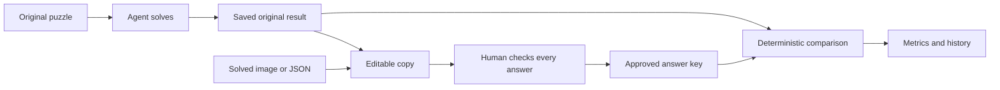

# Evaluate a saved solve

Think of the original agent result as a student's submitted test. An answer key is the teacher's marking sheet. Editing the marking sheet must never change the submitted test.

## Three ways to supply the marking sheet

1. **Correct a copy:** choose a run and edit its copied grid. Original letters are upright; changed cells use italic letters and peach highlighting. Blocks and given letters stay fixed. Check every unchanged answer too.
2. **JSON:** upload, drop, or paste an object containing `reference_grid`, an array of complete row strings. `#` marks blocks/absent cells. Include `puzzle_id` and the puzzle fingerprint when available to catch accidental mismatches.
3. **Solved image:** upload, drop, or paste a PNG/JPEG/WebP answer image. The vision model transcribes visible characters into the original puzzle's layout. It is told not to solve clues or guess missing letters. Review the draft before approval; a vision transcription is not automatically a verified key.

An unsolved puzzle image is not an answer key. Unknown characters stay blank, and incomplete keys cannot receive an ordinary full-puzzle accuracy grade. A matching layout alone cannot prove that an image belongs to the selected puzzle; the user must check the pairing and every answer.

For the three existing development cases, compatible draft files are available as `artifacts/user-puzzles/pets.answer-key.json`, `cocoa.answer-key.json`, and `math.answer-key.json`. These come from the existing development references and still require your review; they have not been independently approved by a human.

After approval, the server scores the original result against the separate key. A later correction creates another reference version and grade. It does not overwrite the original run or earlier grades.

There is deliberately no path from the answer key back into the solving model.

## What the scores mean

| Metric | Plain meaning | Needs an answer key? |
|---|---|---|
| Cell accuracy | Correct letters/digits divided by all open cells. Blanks count as wrong. | Yes |
| Answer accuracy | Entirely correct across/down answers divided by all entries. One wrong character makes that answer wrong. | Yes |
| Completion | Filled open cells divided by all open cells, including incorrect letters. | No |
| Perfect puzzle | Every open cell is correct and there are no rule violations. | Yes |
| Rule violations | Independently detected wrong lengths, invalid characters, crossing conflicts, changed givens, or inconsistent displayed outputs. | No |
| Solve time, calls, tokens | Resource use recorded during the original solve. | No |

Crossing cells are counted once for cell accuracy. Across and down entries are each counted for answer accuracy. Given characters are included in the basic cell score; the detailed report also measures accuracy on originally blank cells.

For example, the first Cocoa development run filled all 64 cells, but only 60 letters and 11 of 12 answers matched the development reference key. That gives 100% completion, 93.75% cell accuracy, 91.67% answer accuracy, zero rule violations, and no perfect-puzzle success. This historical Flash example does not measure the new GLM-5.3 model.

## Read the history chart carefully

Each bar is an explicitly identified run/attempt. Its length is **correct whole answers divided by all entries**, not the number of filled squares. Repeated attempts are separate observations, not different puzzles. Runs without an approved reference are labelled ungraded, rather than scored as zero or displayed as correct.

The perfect-run summary uses only graded runs and displays its denominator. It is not a representative accuracy benchmark when you choose which runs to grade. For a fair benchmark, define the puzzle set and attempt policy in advance, obtain all references independently, and grade every attempt, including failures.

## Human approval and an LLM judge

A trusted publisher key or independently prepared, checked human key provides stronger evidence than correcting a copy of the agent's output. Reviewing a copy can anchor a reviewer to the model's guesses. The interface records the key source and says that scores are comparisons with the approved key, not proof that the reference itself is flawless.

An LLM judge is unnecessary for exact letter comparison. Another model could offer a diagnostic opinion about an ambiguous clue, but it can agree with a wrong answer. It should not replace the reference or manufacture a ground-truth accuracy score. This application does not use an LLM judge for grading.

## Models and resource accounting

`NEBIUS_MODEL=zai-org/GLM-5.3` controls word solving. `NEBIUS_VISION_MODEL=zai-org/GLM-5.3-Flash` controls input-image and answer-image reading. The official [GLM-5.3 documentation](https://docs.z.ai/guides/llm/glm-5.3) specifies text-only inputs, while the [Flash model card](https://huggingface.co/zai-org/GLM-5.3-Flash) documents image input. Both exact IDs were present in the configured Nebius account's model listing during implementation.

Grading a JSON or edited-grid key makes no model call. Answer-image extraction consumes separate vision calls and tokens, excluded from the original solver's metrics. Solving and vision pricing have separate optional settings; unknown costs remain unknown. A one-clue transport smoke test confirms GLM-5.3 request compatibility, not broad crossword accuracy.

For clear, regular images whose detected mask matches the selected puzzle, code crops to the actual grid and enlarges small cells before transcription. The model returns characters for open cells in each row; code restores block positions from the original geometry. This removes the need for the model to count long runs of `#` characters. Unknown letters stay unknown. A development screenshot check read 62 of 64 cells correctly in 5.265 seconds after this preprocessing; two characters still needed review. Earlier unfocused attempts misread cells or exhausted the response budget. This is one development case, not a general OCR accuracy result. The saved checks are under `artifacts/verification/answer-image-live-smoke*.json`.

## Local persistence and limitations

Run snapshots and reference versions are stored in local SQLite under `artifacts/private/`, excluded from Git and packaged submissions. Active jobs cannot resume after a server restart; an abrupt crash can prevent a final result snapshot from being saved. Historical imported runs start ungraded, preserve their original model identity, and label their import time rather than claiming it was the original solve date. The older authored benchmark remains separately labelled with its actual model and evaluation date.

Answer-image extraction attempts are stored separately with their model, usage, draft/error status and reported uncertainty; image bytes are not retained in history. Usage for failed transport calls can be unknown. Graded-run summaries display their own denominator and separately retain attempts with no result; they must not be presented as an all-attempt benchmark success rate.

Screenshot reading can still misread clear-looking text. Human approval can still miss an error. Neither structural checks nor model confidence establishes semantic correctness. Report these limits alongside measured results.
